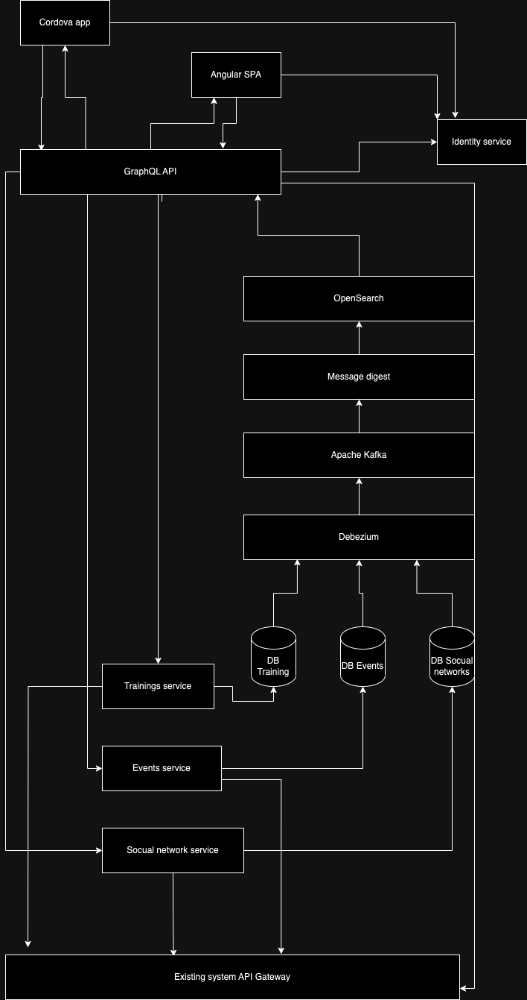

# Базовая архитектура

## Диаграмма

На начальном этапе решено не привлекать дополнительных разработчиков. У frontend разработчиков компании есть достаточно опыта в написании Angular SPA приложений. За связь с сторонними соцсетями отвечает домен Social network service. Хранилище баз данных решено разместить в VK Cloud, так же как и Apache Kafka и OpenSearch, это требует оплаты. Для каждого домена работает оркестрация через. В качестве оркестратора используется Kubernetes.

Для каждого домена определена своя база данных, которая через Debezium и apache kafka отправляет сообщения в сервис Message Digest для обработки, агрегации и добавления данных в индекс OpenSearch.

API GraphQL является gateway api. Через него можно получить агрегированные данные из хранилища OpenSearch а так же сохранить даныые в любой из сервисов, в том числе и с существующим кодом приложения.

## Нефункциональные требования

Требования остаются такими же как в пункте №09 однако стоит добавить:

### Message Digest

1. Сервис должен обрабатывать сообщение немедленно при получении;
2. Для получения сообщений из apache kafka должен быть реализован механизм round robin, для исключения обработки одного и того же сообщения двумя разными инстансами message digest;
3. Процесс реиндексации по требованию не должен занимать более 1.5 часа;

### GraphQL API

1. Авторизация пользователя должна происходить по протоколу OAuth 2.0;
2. Доступ к отдельным данным должен быть закрыт Resource Based Auth;
3. API не должно отдавать какие либо данные в случае провала авторизации по одному и более полей;
